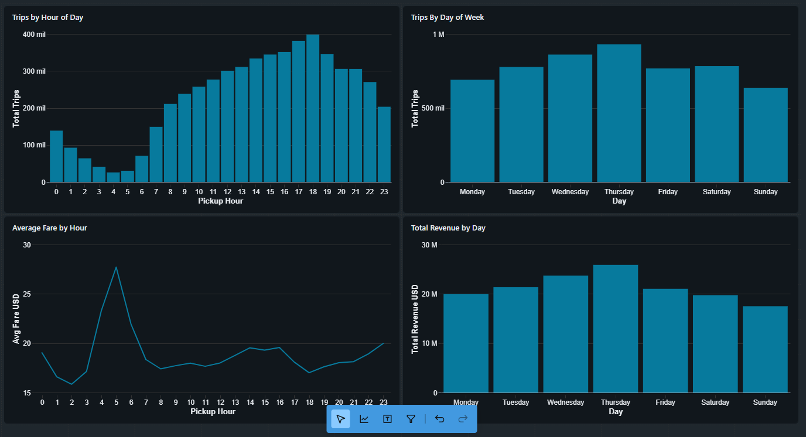

# NYC Taxi Pipeline — Databricks Data Engineering Project

End-to-end data engineering pipeline built on Databricks Community Edition,
processing NYC Yellow Taxi trip data using the Medallion Architecture (Bronze → Silver → Gold).

## Architecture
Raw Files (Parquet)
↓
Bronze Layer  →  Raw ingestion as Delta Table (5.97M rows)
↓
Silver Layer  →  Cleaned and transformed data (5.44M rows)
↓
Gold Layer    →  Aggregated data ready for analysis

## Dashboard Preview



## Key Findings

- **Peak hour**: 6 PM with 398K trips — classic Manhattan rush hour
- **Busiest day**: Thursday with 930K trips and highest revenue
- **Early morning anomaly**: Hour 5 has the longest avg distance (10.3 miles) — likely airport runs
- **January vs February**: Nearly identical volume (~2.72M trips each month)


## Tech Stack
- Apache Spark / PySpark
- Delta Lake
- Databricks Community Edition
- Python 3

## Dataset
NYC Yellow Taxi Trip Records — January & February 2024  
Source: [NYC Taxi & Limousine Commission](https://www.nyc.gov/site/tlc/about/tlc-trip-record-data.page)

## Pipeline Details

| Layer  | Table | Rows | Description |
|--------|-------|------|-------------|
| Bronze | `bronze_yellow_taxi` | 5,972,150 | Raw Parquet ingestion |
| Silver | `silver_yellow_taxi` | 5,443,409 | Cleaned + derived columns |
| Gold | `gold_hourly_performance` | 24 | Aggregated by hour |
| Gold | `gold_daily_performance` | 7 | Aggregated by day of week |
| Gold | `gold_monthly_comparison` | 2 | January vs February |

## Project Structure
```
├── notebooks/
│   ├── 01_bronze_ingestion.py
│   ├── 02_silver_transformation.py
│   └── 03_gold_aggregations.py
├── data/
│   ├── raw/        # Local Parquet files (not tracked by Git)
│   └── sample/
├── docs/
│   └── Dashboard_preview.png
└── README.md
```

## Status
✅ Complete